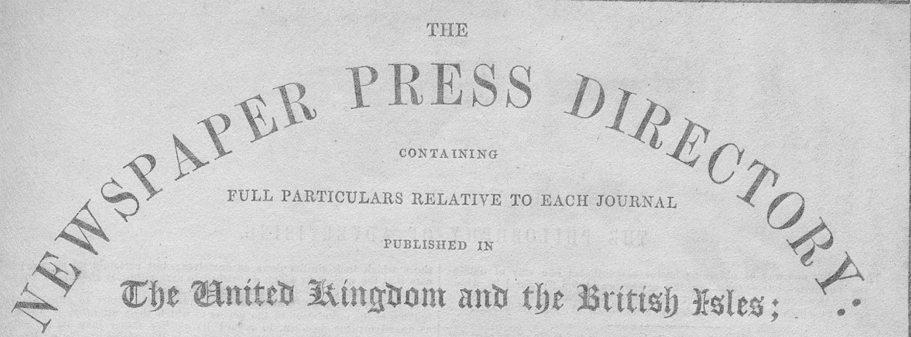
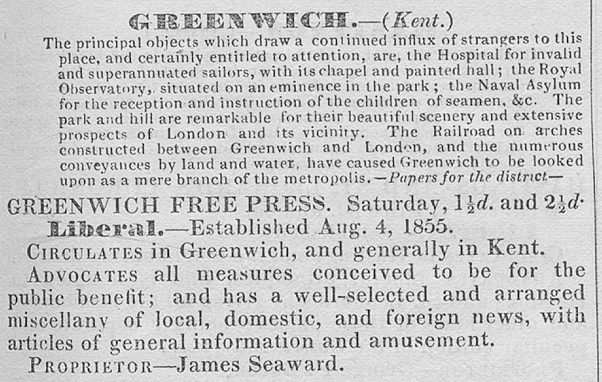

# Addressing Bias and Representativeness in Digital Heritage Collections

# Overview

- [Introduction](#introduction)
- [Data](#data)
    - [Press Directories](#press-directories)
        - [Processing](#processing)
        - [Description](#description)  
    - [JISC](#jisc)
        - [Datasets](#datasets) 
- [Code](#code)
    - [Python Notebooks](#python-notebooks)
    - [R Notebooks](#r-notebooks) 

# Introduction

This repository contains data and code for the paper:

Kaspar Beelen, Jon Lawrence, Daniel C.S. Wilson, David Beavan, "Addressing bias and representativeness in digital heritage collections", _Digital Scholarship in the Humanities_, (forthcoming)

# Data

## Press Directories

This repository contains a structured conversion of Mitchell's Newspaper Press Directories between 1846 and 1920. You can download a zipped version [here](https://github.com/Living-with-machines/PressDirectories/blob/main/data/Press_Directories_1846_1920_JISC_final.csv.zip). The original images and XML are available on the British Library repository.

The press directories appeared almost yearly after 1846 and listed newspapers circulating in the United Kingdom, often giving a detailed description of their audiences. 

The image below shows a fragment of the `Greenwich Free Press` taken from the 1857 Newspaper Press Directory, which we use as our leading example in the data [description](#description).

### <ins>Processing</ins>

Mitchell’s Press Directories were scanned by the British Library imaging studio in 2019 and further processed and enriched by Kaspar Beelen as part of the Living with Machines project.

The main goal of the enrichment was to transform scans into a structured format, which implied automatically recognizing the separate entries as well as parsing their content (i.e. finding the title, price and political leaning etc.). However, as often with heritage collections, this proved more difficult than initially anticipated. As the above figure shows, the typesetting of the directories follows a rather rigid pattern, but the varied use of fonts and types proved challenging for standard OCR software such as ABBYY.  Using Transfer Learning, a technique in which large models are fine-tuned on an often smaller, domain-specific (historical) dataset, we managed to improve the quality. We created a pipeline that attunes each step to the particularities of the historical resource. The first step included image processing. We finetuned a UNet to convert images into columns and removed some features that caused trouble for the OCR software, for example, the drop-down capitals. Then we trained a Tesseract 5 model, by fine-tuning it on line-transcriptions from the press directories. 

The OCR was then further processed in two stages: page splitting and semantic annotation. The first part divides pages into their main components, i.e. the districts in which the newspapers circulated (with a sort of stub text that aims to characterize a place) and the newspaper entries. The second part then parses these profiles, to extract specific information, on top of which we added some further normalisation (unifying the political labels and prices and places of publication). Parsing and semantic tagging were done by fine-tuning BERT models on a set of annotations. Lastly, we created a record linker (also by training BERT on pairs of titles) which allowed us to follow a particular newspaper over time. 

Lastly, to improve the quality of the data, we performed a light-touch manual correction of the data for a selected number of years. This allowed us to spot-check for serious errors (which fortunately didn’t appear) and correct titles and places of publication that proved difficult for the OCR engine to process. While not flawless we are confident that the data generated from the scans are reliable enough for the environmental scan analysis.

### <ins>Description</ins>

Below we describe the content of each column in the structured Newspaper Press Directories.

**id**: identifier of the record, in the shape of MPD_{YEAR}_{POSITION}, i.e. `MPD_1846_3` is the third newspaper encountered in the 1846 edition.

**TITLE**: The title of the newspaper, i.e. `Greenwich Free Press`.

**POLITICS**: The political leaning of the newspaper, in this case `Liberal`, other frequent values are `Conservative`, `Neutral` or `Independent`.

**CATEGORY**: The chapter in which the newspaper appeared, in this case `provincial` as Greenwich wasn't absorbed by London yet in 1857. Other categories are `london`, `welsh`, `scottish`, `irish` and `isles`.

**DISTRICT_PUB**: District of publication `Greenwich`.

**COUNTY_PUB**: County of publication `Kent`. The press directories are alphabetically ordered by district.

**PRICE**: The prices indicated for this newspaper, if more than one price is mentioned, then these are joined by a `<SEP>` token, for example `1½d<SEP>2½d`. **Warning**: Prices are not processed further and need to be converted (see Notebook 2_Analysis.ipynb).

**ESTABLISHED_DATE**: Marks the date a newspaper was established. Varies in precision (from an exact day to year). In this case, the date given was Aug 4. 1855. **Warning**: Dates are not normalized or converted to time-stamps, this would require further processing.

**PUBLICATION_DAY**: The day of publication, often refers to a day in the week (e.g. `Thursday`), or specific in periodic terms such (`daily` or `weekly`). The `Greenwich Free Press` was published on `Saturday`.

**LOCATIONS**: Locations mentioned in the description.This includes places where the newspaper was presumed to circulate and often gives a wider range of places compared to the `DISTICT_PUB`. Places are joined by a `<SEP>` token, i.e.`Greenwich<SEP>Kent`

**TEXT_ORIGINAL**: The full-text description for one newspaper. The other items mentioned here (such as price and politics) are extracted from this column. 

**DISTRICT_DESCRIPTION**: A textual description of the district (as captured by `DISTRICT_PUB` and `COUNTY_PUB` ). 

**YEAR**: Year of publication for the edition.

**NEWSPAPER_ID**: This is a unique identifier used to link newspapers over time. 

# JISC

## Datasets

### <ins>JISC Title List</ins>

[This spreadsheet](https://github.com/Living-with-machines/PressDirectories/blob/main/data/JISC_TitleList.xlsx) provides an overview of all titles in the JISC collection. 

### <ins>Linked Title List</ins>

[This table](https://github.com/Living-with-machines/PressDirectories/blob/main/data/jisc_links.csv) provides an overview of all titles in the JISC collection with links to the entry in the Newspaper Press Directories. 

**LINKING_METHOD**: indicates how the titles were linked. 'manual': link established via manual annotation. 'newspaper_id' link established via the newspaper id of a 'manual' link.

**BL_SYSTEM_ID**: The System ID associated with the newspaper. 

**NPD_ID**: The id of the newspaper in the digitized version of Mitchells Newspaper Press Directories.

**JISC_TITLE**: The title of the newspaper as recorded in the JISC Title List.

**MITCHELL_TITLE**: The title of the newspaper as recorded in the press directories.

# Code

## Python Notebooks

**[1_Sources_and_Data.ipynb](https://github.com/Living-with-machines/PressDirectories/blob/main/code/1_Sources_and_Data.ipynb)**: Code for reproducing results and figures for the introduction

**[2_Analysis.ipynb](https://github.com/Living-with-machines/PressDirectories/blob/main/code/2_Analysis.ipynb)**: Code for reproducing results and figures for the Analysis section (up to the "Beyond Labels" heading.

**[Appendix_JISC_Links.ipynb](https://github.com/Living-with-machines/PressDirectories/blob/main/code/Appendix_JISC_Links.ipynb)**: Code for producing the Linked Title List.

## R Notebooks

Running these notebooks requires installation of the [Structural Topic Model](https://www.structuraltopicmodel.com/) library.

**[train_topics_jisc.Rmd](https://github.com/Living-with-machines/PressDirectories/blob/main/rscripts/train_topics_jisc.Rmd)**: Code for training a Structural Topic Model on descriptions derived from the press directories.

**[explore_jisc_topics.nb.Rmd](https://github.com/Living-with-machines/PressDirectories/blob/main/rscripts/explore_jisc_topics.Rmd)**: Code for inspecting the Structural Topic Model and reproducing the figures in the section "Beyond Labels: Topics in Contemporaneous Descriptions"
